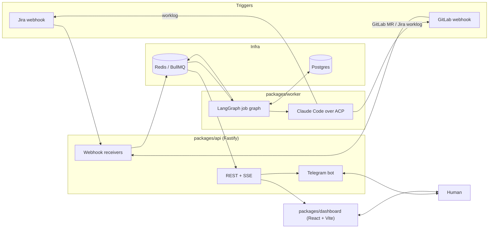
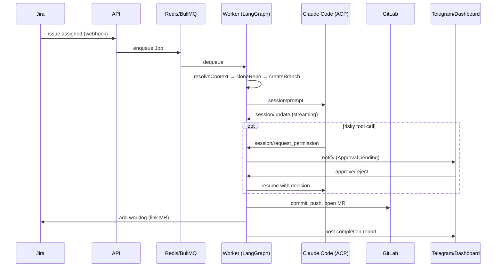
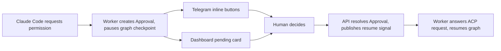
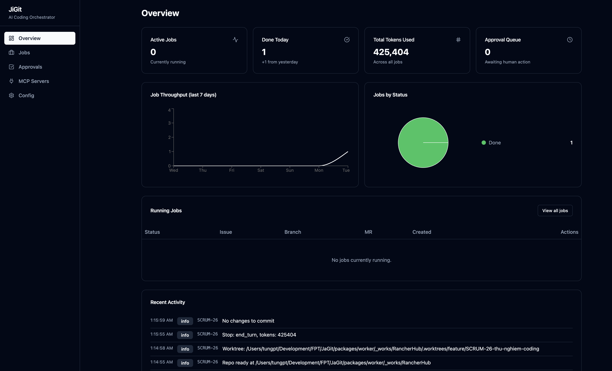
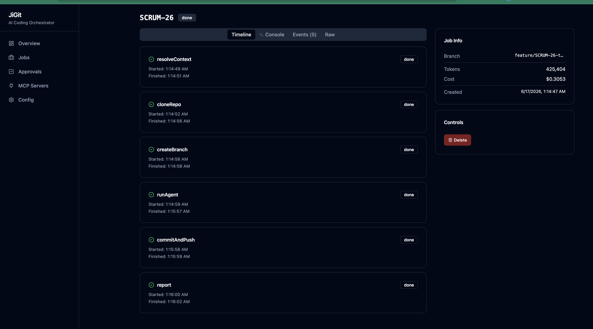
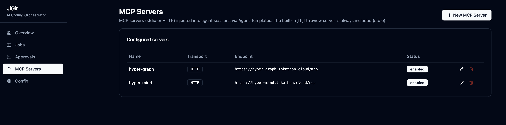
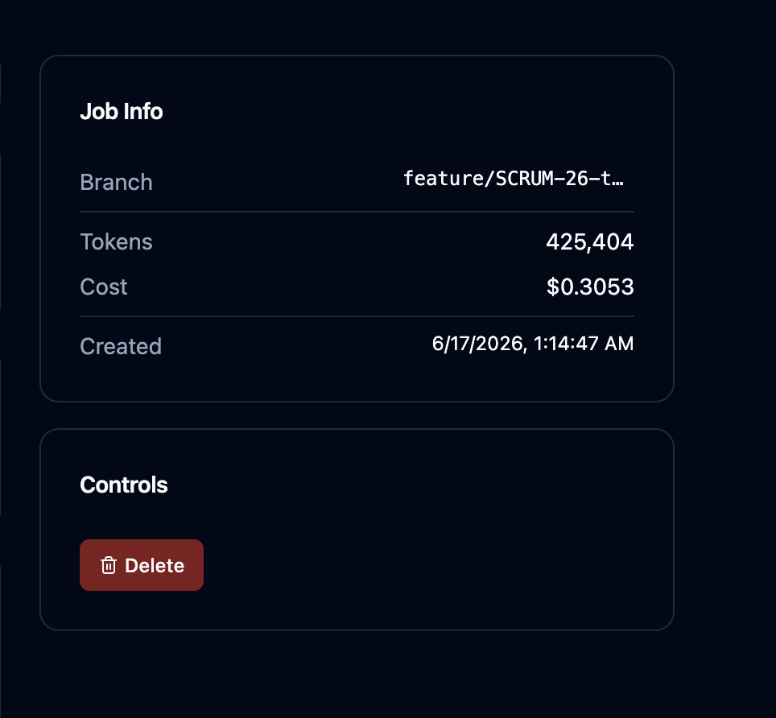
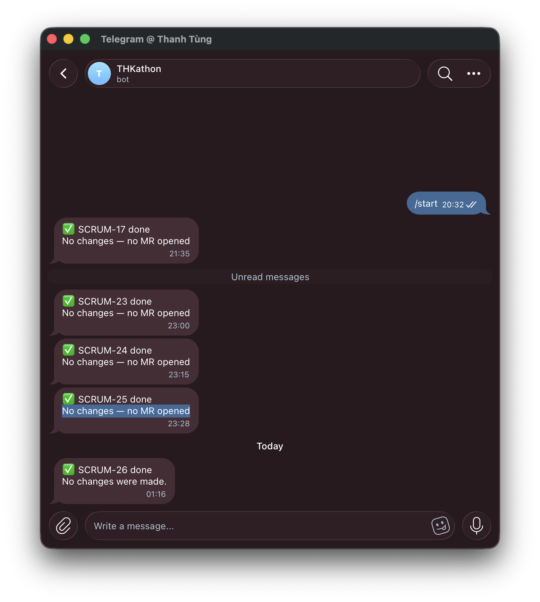
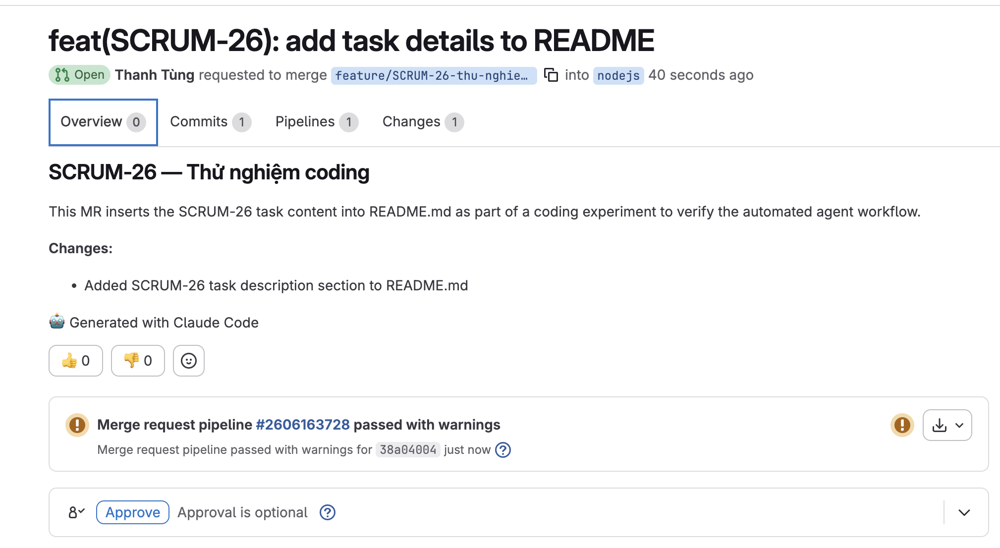

# JiGit

Orchestrator for AI coding agents that work with **Jira** and **GitLab**.

## Why

Repetitive Jira tickets (bug fixes, small features) sit in a backlog until a
human picks them up. JiGit lets an AI coding agent pick them up instead:
assign a Jira issue to the JiGit bot, and it clones the repo, drives an
interactive **Claude Code** session to implement the change, opens a GitLab
merge request, logs the work back to Jira, and reports to Telegram — while a
human stays in the loop for risky steps via approval checkpoints.

## Goals

- **Autonomous by default** — the agent codes without hand-holding; it only
  pauses when it needs a permission decision (e.g. a risky tool call).
- **Human-in-the-loop where it matters** — approve/reject from Telegram
  inline buttons or the dashboard, whichever is faster for the human.
- **Traceable** — every job has a live step timeline, event log, token/cost
  tracking, and a resulting MR + Jira worklog.
- **Bounded** — concurrency capped per the "max N agents" rule, retries
  bounded, secrets encrypted at rest.
- **Config-driven, not hardcoded** — agent templates, repo↔branch mapping
  rules, and credentials are data (seeded), not code.

Non-goals for the MVP (deferred): real token-usage ingestion (dashboard uses
mock charts for now), Microsoft Teams, GitLab comment/build-failure triggers,
an Agent Manager CRUD UI, multi-tenant auth. See
[`docs/superpowers/specs/2026-06-14-jigit-mvp-design.md`](docs/superpowers/specs/2026-06-14-jigit-mvp-design.md)
for the full design and scope boundary.

## Architecture

pnpm monorepo, all TypeScript.



**Services**

| Package              | Role                                                                                                       |
| -------------------- | ---------------------------------------------------------------------------------------------------------- |
| `packages/shared`    | Config, crypto, Prisma client, BullMQ/Redis helpers, retry policy, branch logic, shared types              |
| `packages/api`       | Fastify: webhook receivers, REST + SSE for the dashboard, Telegram bot, serves the built dashboard         |
| `packages/worker`    | BullMQ consumer running a per-job LangGraph graph (Postgres checkpointer) that drives Claude Code over ACP |
| `packages/dashboard` | React + Vite + shadcn/ui                                                                                   |

Postgres is the source of truth (jobs/steps/events/approvals + LangGraph
checkpoints); Redis is the queue plus live pub/sub.

### Job lifecycle



### Approval flow



Whichever channel (Telegram or dashboard) responds first wins; an unanswered
approval auto-expires (deny) after `APPROVAL_TIMEOUT_MS` so it can't pin a
worker slot forever.

## Screenshots

| Overview                                                  | Job detail                                                  |
| --------------------------------------------------------- | ----------------------------------------------------------- |
|  |  |

| MCP servers config                                   | Token usage                                                  |
| ---------------------------------------------------- | ------------------------------------------------------------ |
|  |  |

| Telegram alerts                                                | GitLab merge request                                                |
| -------------------------------------------------------------- | ------------------------------------------------------------------- |
|  |  |

## Setup

### Prerequisites

- Node.js 20+, pnpm 9
- Docker (for Postgres/Redis, or run the full stack in containers)
- Anthropic API key, a Telegram bot token, and Jira/GitLab credentials for the
  repos you want JiGit to act on

### 1. Install dependencies

```bash
pnpm install
```

### 2. Configure environment

```bash
cp .env.example .env
# fill in DATABASE_URL, REDIS_URL, APP_ENCRYPTION_KEY (32-byte base64),
# ANTHROPIC_API_KEY, TELEGRAM_BOT_TOKEN, API_WEBHOOK_SECRET, etc.
```

### 3. Start infra and migrate

```bash
docker-compose up -d postgres redis
pnpm db:migrate
pnpm seed        # seeds agent templates, credentials, repo mappings
```

### 4. Run the services (dev)

```bash
pnpm dev:api        # Fastify API on API_PORT (default 3000)
pnpm dev:worker      # BullMQ worker
pnpm dev:dashboard   # Vite dev server for the dashboard
```

### 5. Or run everything in Docker

```bash
docker-compose up -d
```

This builds and runs `postgres`, `redis`, a one-shot `migrate` job, `api`,
and `worker`. Visit `http://localhost:3000` for the dashboard (served by the
API in production builds).

### Useful commands

```bash
pnpm -r build          # build all packages
pnpm -r test            # run all package test suites
pnpm --filter @jagit/shared test   # test one package
pnpm db:studio          # Prisma Studio
pnpm test:e2e           # end-to-end smoke test
```

## Agent usage reporting (hooks)

JiGit can collect live per-session token/cost/model metadata from the AI coding
agents your team runs locally and show it on the dashboard under **Usage →
Live Sessions**. Each supported tool gets a thin hook adapter that, when a
session finishes, parses that tool's session log and POSTs a snapshot to
`POST /api/agent-sessions` (idempotent per `(tool, sessionId)`).

### Configure the reporter (once per machine)

Set these in your shell rc (`~/.zshrc`, `~/.bashrc`):

```bash
export JAGIT_BASE_URL="https://your-jigit-host"   # JiGit API base URL
export JAGIT_API_KEY="<your DASHBOARD_API_TOKEN>" # same value as the server's DASHBOARD_API_TOKEN
# Optional — identity defaults to `git config user.email`:
# export JAGIT_GIT_USERNAME="you@example.com"
```

Reporting never blocks or crashes the agent: missing config or a failed POST is
logged to stderr and ignored.

### Claude Code

Add `Stop` and `UserPromptSubmit` hooks, plus the session MCP server to `~/.claude/settings.json` (or per-project
`.claude/settings.json`):

```json
{
  "hooks": {
    "UserPromptSubmit": [
      {
        "matcher": "",
        "hooks": [
          { "type": "command", "command": "npx -y @jagit/hook-claude-code-time-tracking" }
        ]
      }
    ],
    "Stop": [
      {
        "matcher": "",
        "hooks": [
          { "type": "command", "command": "npx -y @jagit/hook-claude-code" }
        ]
      }
    ]
  },
  "mcpServers": {
    "jagit-session": {
      "command": "curl",
      "args": [
        "-s",
        "-X", "POST",
        "-H", "x-api-key: ${JAGIT_API_KEY}",
        "-H", "x-git-username: ${JAGIT_GIT_USERNAME}",
        "-H", "Content-Type: application/json",
        "-d", "@-",
        "${JAGIT_BASE_URL}/api/session-mcp"
      ]
    }
  }
}
```

The hooks read the transcript, track session duration, calculate lines-of-code changes, sum the cumulative token usage, and
report on every turn group. If you activate a Jira ticket during your session using the `activate-jira` MCP tool, JiGit will automatically create a worklog on that ticket when the session ends. No install needed (`npx -y` fetches on demand);
for a permanent binary run `npm i -g @jagit/hook-claude-code` and `npm i -g @jagit/hook-claude-code-time-tracking`.

### Codex CLI

Codex has no native hook, so wrap it with a shell function in your rc that runs
the reporter after the real `codex` exits:

```bash
codex() {
  command codex "$@"
  local status=$?
  npx -y @jagit/hook-codex >/dev/null 2>&1 || true
  return $status
}
```

The reporter finds the most recent `~/.codex/sessions/**/*.jsonl`, takes the
session's final cumulative token totals, and reports. (Global install:
`npm i -g @jagit/hook-codex`, then the binary is `jigit-hook-codex`; it also
accepts `--file <path>`.)

### GitHub Copilot CLI

Same wrapper approach (Copilot is seat-based, so `cost` is always reported as
unknown):

```bash
copilot() {
  command copilot "$@"
  local status=$?
  npx -y @jagit/hook-copilot >/dev/null 2>&1 || true
  return $status
}
```

> **Note:** the `@jagit/hook-*` packages must be published to your npm registry
> for `npx -y` to resolve. Until then, run them from a local checkout
> (`pnpm --filter @jagit/hook-claude-code build`, then point the hook command at
> the built `dist/index.js`). Each package's README has the full per-tool
> details.

## Docs

- Design: [`docs/superpowers/specs/2026-06-14-jigit-mvp-design.md`](docs/superpowers/specs/2026-06-14-jigit-mvp-design.md)
- Implementation plan: [`docs/superpowers/plans/2026-06-14-jigit-mvp.md`](docs/superpowers/plans/2026-06-14-jigit-mvp.md)
- Agent session reporting: [`docs/superpowers/specs/2026-06-20-agent-session-reporting-design.md`](docs/superpowers/specs/2026-06-20-agent-session-reporting-design.md)
- Session changelogs: [`docs/changelogs/`](docs/changelogs/), rolled up in [`CHANGELOG.md`](CHANGELOG.md)
